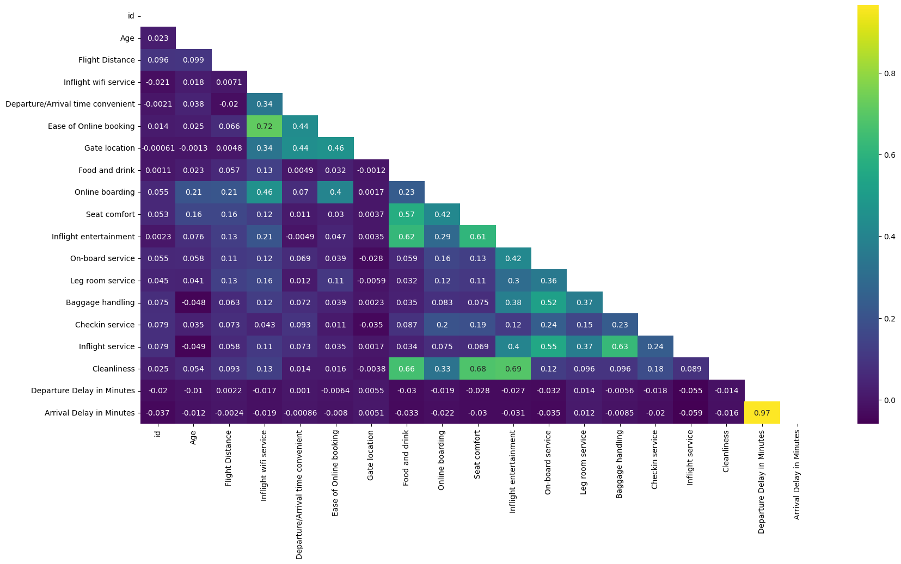
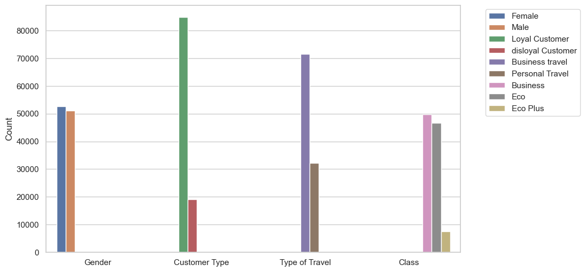
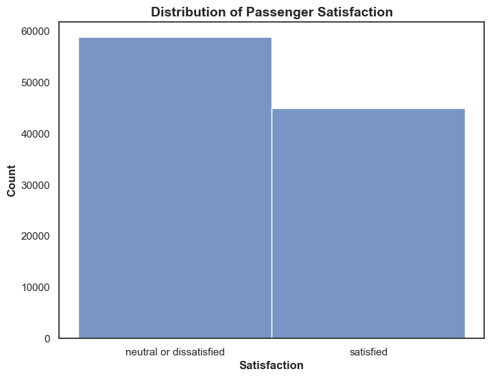
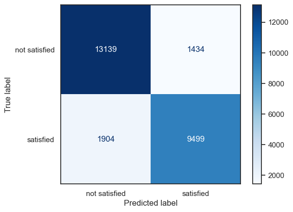
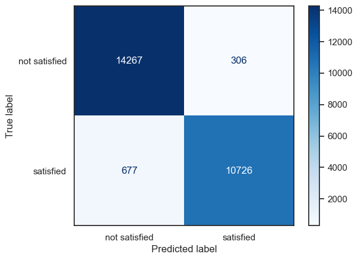

# Airline Passenger Satisfaction
Machine learning project predicting customer satisfaction in the aviation industry

**Author:** [Emmi Galfo](mailto:emmi.galfo@gmail.com)

## Business Problem 

Airline companies strive to provide excellent customer service. Understanding which factors to focus investments on can increase customer retention, enhance customer experience, increase revenue, reduce costs, and improve brand image. I'm asked to predict which factors are most important for passenger satisfaction and to provide actionable insights for airlines to improve their overall customer experience.  

## Overview 

This classification project looks into which factors contribute most in predicting airline customer satisfaction. By using machine learning modeling to analyze customer data, I was able to predict which factors were most important for passenger satisfaction and provide actionable insights for airlines to improve their overall customer experience. My results showed that online boarding, personal vs business travel, and inflight wifi service had the most impact on overall satisfaction. 

## Data Understanding

For this project, a large dataset regarding airline passenger satisfaction and travel features was downloaded from kaggle.com. 

### Shapes of dataframes:
* Total dataframe before the split:  (129880, 23)
* Training shape: (103904, 23)
* Testing shape: (25976, 23)
* Train/Test split: 0.8/0.2

### Column names and descriptions:
Gender: Gender of the passengers (Female, Male)

Customer Type: The customer type (Loyal customer, disloyal customer)

Age: The actual age of the passengers

Type of Travel: Purpose of the flight of the passengers (Personal Travel, Business Travel)

Class: Travel class in the plane of the passengers (Business, Eco, Eco Plus)

Flight distance: The flight distance of this journey

Inflight wifi service: Satisfaction level of the inflight wifi service (0:Not Applicable;1-5)

Departure/Arrival time convenient: Satisfaction level of Departure/Arrival time convenient

Ease of Online booking: Satisfaction level of online booking

Gate location: Satisfaction level of Gate location

Food and drink: Satisfaction level of Food and drink

Online boarding: Satisfaction level of online boarding

Seat comfort: Satisfaction level of Seat comfort

Inflight entertainment: Satisfaction level of inflight entertainment

On-board service: Satisfaction level of On-board service

Leg room service: Satisfaction level of Leg room service

Baggage handling: Satisfaction level of baggage handling

Check-in service: Satisfaction level of Check-in service

Inflight service: Satisfaction level of inflight service

Cleanliness: Satisfaction level of Cleanliness

Departure Delay in Minutes: Minutes delayed when departure

Arrival Delay in Minutes: Minutes delayed when Arrival

Satisfaction: Airline satisfaction level(Satisfaction, neutral or dissatisfaction)

#### Numerical Columns- Training data

Top correlations as seen in the heat map:
* Departure delay and arrival delay are the most strongly correlated.
* Next is ease of online booking and inflight wifi service.
* Finally, cleanliness is correlated with food and drink, seat comfort, and inflight entertainment. 

#### Categorical Columns- Training data

We can see that there were more loyal customers than disloyal customers, more business travelers than personal travelers, and more business and eco seats than eco plus seats.

#### Target- Training data

We can see from the graph above that there are fairly equal amounts of satisfied and neutral/dissatisfied customers. 

## Modeling
The goal of the machine learning modeling is to identify the factors that are most important for predicting passenger satisfaction and to develop a model that can accurately classify passengers as either satisfied or dissatisfied.

The approach to this problem is to create a model that minimizes False Positives so that it does not predict many passengers are satisfied when they are not.  The model will be evaluated using a precision score. This explains out of all the satisfied predictions how many are correctly labeled. 

### Model 1: Logistic Regression 

Lets start with simple logistic regression classifier.

__Test Results:__
* precision score: 0.87
* recall score: 0.87
* f1 score: 0.87

The initial model returned a precision score of 87%. It is important that the dissatisfied customers are labeled correctly. The top two boxes on the table show all of the dissatisfied customers and are split based on whether the model predicted them correctly or not. The initial model correctly labeled 13,139 dissatisfied customers and mislabeled 1,434. 

### Final Model: XGBoost
The final model used is an XGBoost Classifier. After a grid search, parameters were tuned to random_state=42, learning_rate=0.01, n_estimators=1000, max_depth=7. 

__Test Results:__
* precision score: 0.97
* recall score: 0.96
* f1 score: 0.96

The final model had a precision score of 97%! This is much better than the initial score. The final model only mislabelled 306 dissatisfied customers. 

